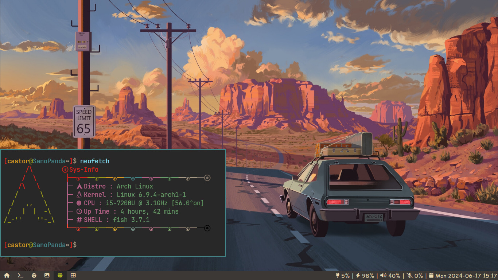

# Table of content:
- [Applied Patches](#applied-patches)
- [Features and Keybindings](#features-and-keybindings)
- [Dependencies](#dependencies)
- [Configuration](#configuration)
- [Installation](#installation)



### Applied Patches

- [notitle](https://dwm.suckless.org/patches/notitle/): This patch hides your window's titles in dwm-bar.

- [restartsig](https://dwm.suckless.org/patches/restartsig/): This patch allows user to restart dwm via Mod+CTRL+SHIFT+Q or by `kill -HUP dwmpid`.

- [swallow](https://dwm.suckless.org/patches/swallow/): This patch adds "window swallowing" to dwm. Example, when you open a gui application from terminal, it hides the terminal in background, leaving that application only without splitting terminal and that application; terminal can be accessed back after closing the gui application.

- [alwayscenter](https://dwm.suckless.org/patches/alwayscenter/): This patch places all the floating windows in the centere of screen, like the center patch, but without a rule.

- [togglefloatingcenter](https://dwm.suckless.org/patches/togglefloatingcenter/): Default behaviour when togglefloating() is floating from top-left corner. This patch will allows you to toggle floating window client will be centered position.

- [fullgaps](https://dwm.suckless.org/patches/fullgaps/): This patch adds gaps between client windows.

- [hide vacant tags](https://dwm.suckless.org/patches/hide_vacant_tags/): This patch prevents dwm from drawing tags with no clients (i.e. vacant) on the bar.

- [rotatetags](https://dwm.suckless.org/patches/rotatetags/): This patch provides the ability to rotate the tagset left/right. It implements a new function rotatetags which modifies the current tagset.

- [scratchpads](https://dwm.suckless.org/patches/scratchpads/): This patch enables multiple scratchpads, each with one asigned window.

- [preserveonrestart](https://dwm.suckless.org/patches/preserveonrestart/): By default, when dwm is recompiled-restarted all clients will lose it's current tag and collapse to first tag. This patch preserves clients on old tags, however note that layout order is not preserved.

- [colorschemes](https://dwm.suckless.org/patches/colorschemes/): This patches provides the ability to cycle between any number of colorschemes defined in config.h.

### Features and Keybindings
Mod/MODKEY or Mod1Mask key is referred to <kbd>Alt</kbd> key.  
Super/Mod4Mask or Meta key is referred to <kbd>Windows</kbd> or <kbd>⌘ Command</kbd> key.
- applied kitty as default scratchpad terminal (`Mod+x`)
- applied keepassxc as scratchpad password manager (`Super+p`)
- applied swallow feature for kitty terminal
- Removed clickability from the bar
- Reconfigured `Mod+button1` to move window and `Mod+Shift+button1` to resize window. (Earlier both were done by `Mod+button1`)
- Added `Mod+r` to move window and `Mod+Shift+r` to resize window using mouse/touchpad.
- `Mod+shift+Left` and `Mod+shift+Right` to change the tags/worksapces.

### Dependencies

- [freetype2](https://archlinux.org/packages/extra/x86_64/freetype2/)
- [libxcb](https://archlinux.org/packages/extra/x86_64/libxcb/)
- [libxinerama](https://archlinux.org/packages/extra/x86_64/libxinerama/)
- [libx11](https://archlinux.org/packages/extra/x86_64/libx11/)
- [libxft](https://archlinux.org/packages/extra/x86_64/libxft/)
- [nerd-fonts](https://github.com/ryanoasis/nerd-fonts)

### Configuration
Edit config.mk to match your local setup (dwm is installed into the /usr/local namespace by default).

The configuration of dwm is done copying [config.def.h](config.def.h) to `config.h`, editing it and then (re)compiling the source code.

### Installation

1. Install all the required [dependencies](#dependencies).

2. Install dwm.

```
sudo make install
```

**If you want my bar, checkout my my build of [dwmblocks](https://github.com/whoisyoges/dwmblocks).**
